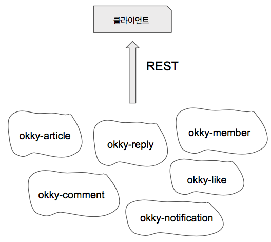
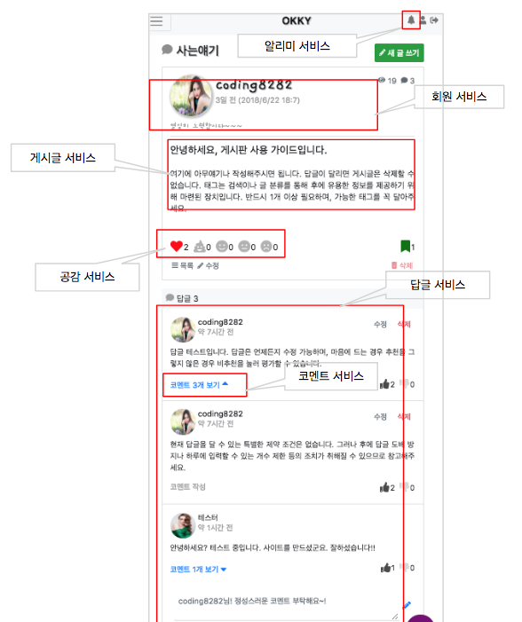

# 옼희
[https://okky.org](https://okky.org)

옼희는 개인적으로 만들고 있는 프로젝트로 okky.kr에 SNS 기능을 덧붙인 사이트입니다.

아시다시피 우리나라 개발자 취준생 표준포트폴리오는 '게시판'인데요, okky도 게시판의 모임이고 한 사용자로서 비슷한 시스템을 
만들어보고 싶었습니다. 다만 Distributed System 컨셉을 적용하고 싶었고, 클라우드 환경에서 호스팅해 리얼하게 
동작하도록 하는 것이 목표입니다.

# 개요
옼희는 6개의 마이크로 서비스로 구성되어 있습니다. 각 서비스의 알맹이(컨텐츠)는 DDD의 사상을 따르고,
분권된 DB를 갖고, 다른 서비스와 느슨하게 연결되어 있습니다. 궁극적으로 RESTful로 도메인 기능을 노출하며,
모바일웹에서 6개의 마이크로 서비스와 통신합니다. 단, 중간에 API Gateway를 경유하며 인증 및 Throwtling 
등을 제어하여 클라이언트에 일관적인 API 경험을 제공합니다.

* okky-article: 게시판, 게시글 컨텍스트. 핵심컨텍스트.
* okky-member: 회원 관리 컨텍스트.
* okky-like: 좋아요 컨텍스트.
* okky-reply: 답글 컨텍스트.
* okky-comment: 답글의 답글 컨텍스트(대댓글).
* okky-notification: 알리미 컨텍스트.



# 화면
vuejs/nuxt로 되어 있으며 nuxt는 SPA모드로 라우팅 관리 부담을 해소하기 위한 목적으로 이용합니다. 인증은 AWS Cognito를
통합하며 따라서 비밀번호 등의 정보는 Cognito에게 위임하고 okky-member 컨텍스트가 따로 관리하지 않습니다. Bootstrap4, fontawesome,
일부 jquery를 이용하여 화면에 대해 최소한의 지식으로 구성하였습니다. 이 외에 vuex를 이용해 복잡한 화면은 데이터를 중앙 집중 관리하여 복잡도를
낮추기 위해 노력합니다.

* 기술: vuejs2, nuxt1, Bootstrap4, vuex, vue-awesome, vue-axios, vue-cookie, vue-timeago, vue-toast
* 툴: Webstorm, Visual Studio Code, Chrome vue-plugin



[여기](https://okky.org/articles/a-766a2350bf2e41c)를 클릭하면 실제 페이지로 이동할 수 있습니다.

# 서버
기본적으로 Domain Driven Design 컨셉을 따르며, 서비스별로 나누어진 Bounded Context와 Rich Domain Model로 알맹이를 채운
형태로 구성되어 있습니다. 모델은 일차적으로 자신의 상태를 책임지며, 도메인서비스와 응용서비스에게 행동을 노출합니다. 응용서비스는 유스케이스를
소화하기 위해 도메인모델, 리파지터리 등과 협력하여 목표를 달성하고 또 트랜잭션을 담당합니다. 하나의 유스케이스가 여러 Aggregate를
수정하려 할 때는 트랜잭션 적합성을 분석하여, 하나로 묶을지 그렇지 않다면 도메인 이벤트를 이용하여 Eventual Consistency를 준수합니다.
각 컨텍스트는 느슨한 결합을 달성하기 위해 큐나 RESTful로 통신합니다.

 * 설계: Domain Driven Concept
 * 기술: Java8, Spring Boot, Spring Cloud, Spring Cloud AWS, Spring Data, JUnit4, Lombok, JPA, Maven 등
 * 외부 서비스(일반 도메인): AWS Cognito, API Gateway, SQS, SNS, SES, S3 등

옼희는 youtube, facebook 등 주로 SNS 서비스에 있는 소셜 기능들을 DDD 컨셉에 입각하여 모델링하고 구현합니다. Service-DAO-DTO의
획일화된 Anemic Domain Model을 지양하고 도메인이 지능을 갖고 잦은 요구사항 변경에 대응하기 위해 설계합니다. 각 모델은 지능을 갖고
자기 자신을 책임지며 응용서비스에 필요한 최소한의 행동을 노출합니다. 모델이 커지는 것을 예방하여 복잡도를 낮추기 위해 노력합니다.

```java
// 좋아요(공감) 구현
// 1. 공감 표현이 아닌 경우 단순히 생성
// 2. 좋아요 -> 좋아요인 경우 토글
// 3. 좋아요 -> 미워요인 경우 공감 표현을 교체(replace) 
public void doEmotion(String targetId, String memberId, String emotionType) {
    EmotionType type = EmotionType.parse(emotionType);

    boolean alreadyEmoted = helper.wasAlreadyEmoted(targetId, memberId);
    if (alreadyEmoted) {
        Emotion emotion = repository.findByTargetIdAndMemberId(targetId, memberId).get();
        if (emotion.isSameEmotionType(type))
            repository.delete(emotion); // 2번 케이스
        else
            emotion.replaceEmotionType(type); // 3번 케이스
    } else {
        doEmotion(targetId, memberId, type); // 1번 케이스
    }
}
```

[공감 기능 구현 아이디어](http://blog.coding8282.com/221304470858)

[댓글 고정 기능 구현 아이디어](http://blog.coding8282.com/221305747544)


# 인프라
AWS 서비스를 이용하고 있으며 prod, stg, dev 환경을 완전하게 독립하여 운영하고 있습니다. dev 환경에서 작업후 stg로 이관하여
문제가 없으면 prod으로 배포하는 전형적인 형식을 취합니다. 다만 관리 이슈를 완화하기 위해 AWS Code 시리즈로 배포 프로세스를 자동화하고
있습니다.

 * 호스팅: 각 서비스는 EC2에서 구동되어 ELB를 통해 궁극적으로 API Gateway를 경유하여 트래픽을 소화합니다. 화면은 S3에서 static web 
 hosting을 통해 운영되고 있습니다.
 * 인증: AWS Cognito에 전적으로 위임하며 비밀번호 등 민감 정보는 Cognito가 전담합니다. 회원 컨텍스트(okky-member)에서는 회원에 대한
 메타 정보(이름, 좌우명 등)만 관리합니다. 또한 API Gateway와 통합하여 인증을 중앙 집중 관리하며 각 서비스는 특별한 경우를 제외하고 인증에 대해
 신경쓰지 않고 순수한 비즈니스 로직 처리를 전담합니다.
 * DB: okky-comment는 DynamoDB를, okky-notification은 MongoDB를 사용하고 나머지는 RDS MySql을 사용합니다. MongoDB는 
 Atlas Cloud Service를 이용해 관리부담을 최소화하기 위한 목적으로 사용하고 있습니다.
 * Messaging: SNS, SQS를 fan-out 패턴으로 사용하고 있으며, 각 컨텍스트에서 발생하는 도메인 이벤트를 다른 컨텍스트에서 소비하는 
 형식으로 통합합니다. Eventual Consistency와 느슨한 결합을 달성하는 주요 수단으로 이용합니다.
 * CI/CD: AWS Code 시리즈를 적극적으로 활용해 배포 프로세스를 간결하고 빠르게 가져갑니다. GitHub -> CodeBuild -> CodeDeploy로 
 프로세스를 자동화하며, 이 과정을 CodePipeline으로 간소화하여 진행합니다.
